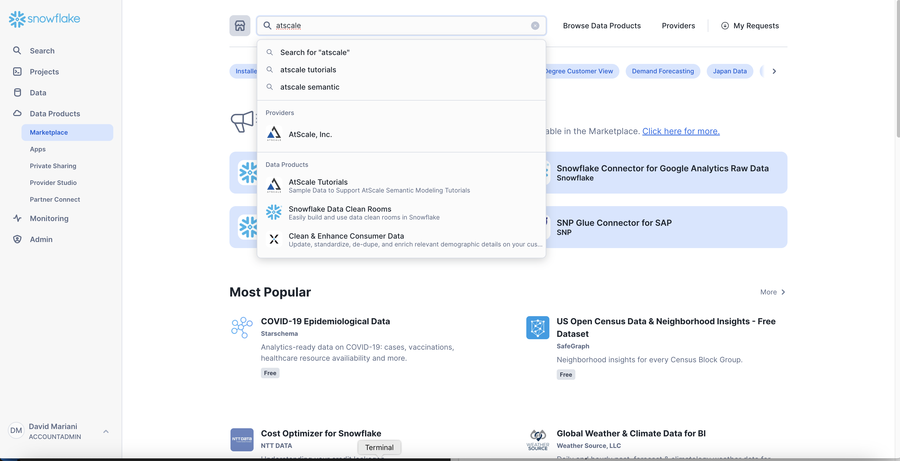
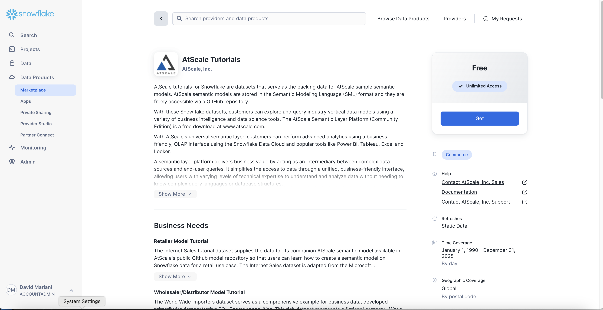
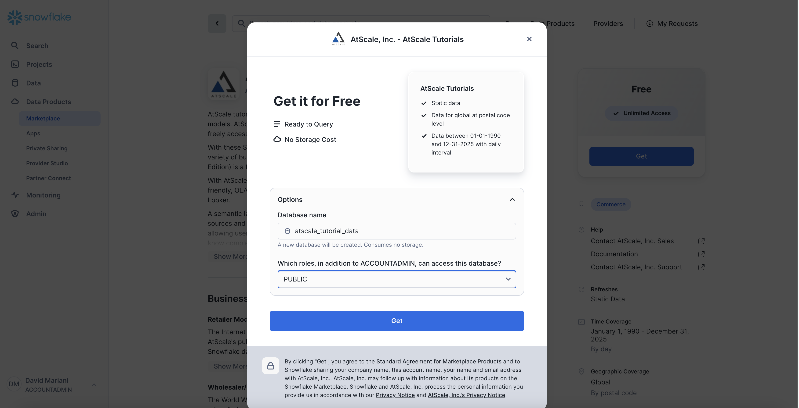
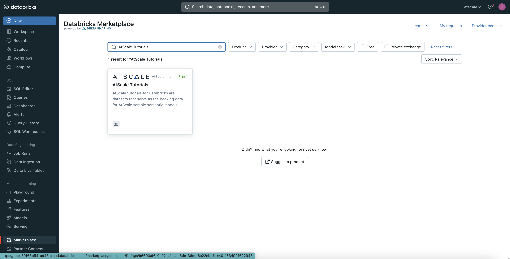
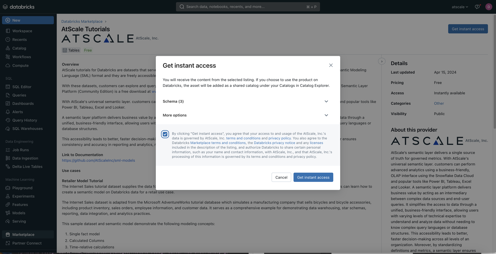
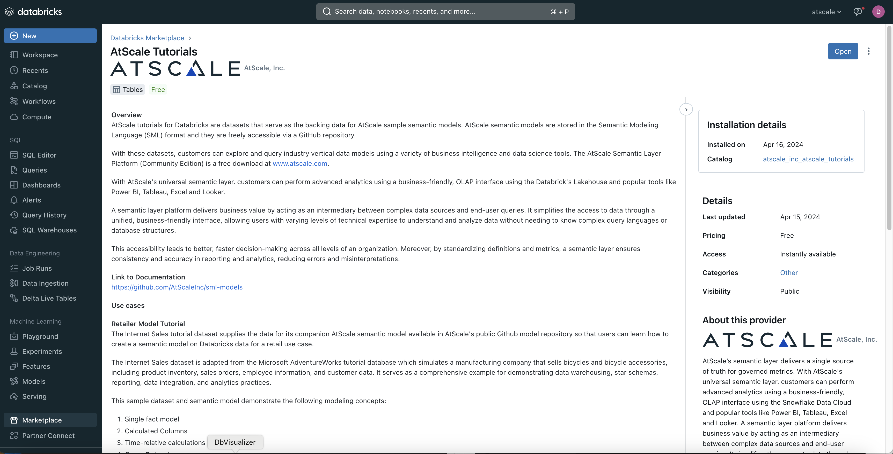
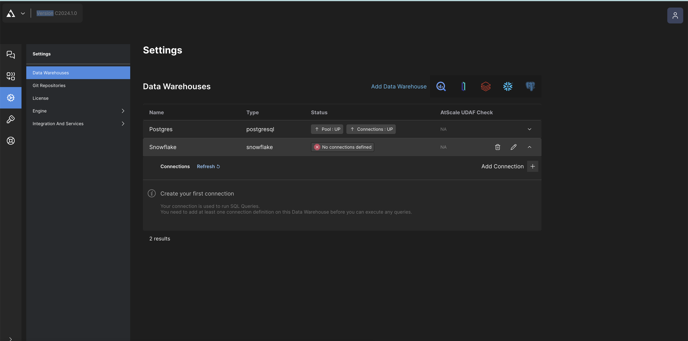
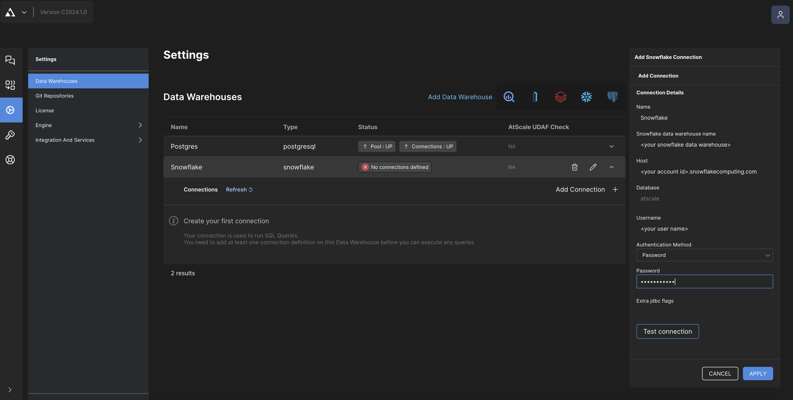
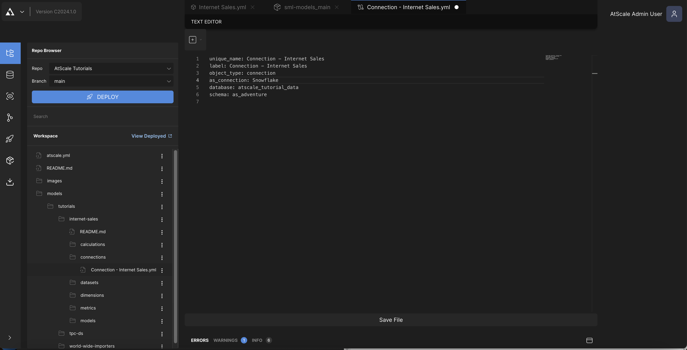

# Internet Sales Model

The Internet Sales dataset is adapted from the Microsoft AdventureWorks tutorial database which simulates a manufacturing company that sells bicycles and bicycle accessories, including product inventory, sales orders, employee information, and customer data. It serves as a comprehensive example for demonstrating data warehousing, star schemas, reporting, data integration, and analytics practices.

## Demonstrated Model Features
1. Single fact model
2. Calculated Columns
3. Time-relative calculations
4. Query Dataset
2. Row-level security

## Supported Data Platforms
1. Snowflake
2. Databricks
3. BigQuery

## Data Model Overview

## Data Loading Instructions

### How to Connect to Snowflake Tutorial Data
The tutorial data for the sample models is available for free in the Snowflake Marketplace. To get access to the tutorial data in the Snowflake Marketplace:

1. **Go to the Snowflake Marketplace:** In the Snowflake console, click on "Data Products" and then click on the "Marketplace" link.

2. **Find the "AtScale Tutorials" data product:** In the search bar, type in "AtScale" and select the "AtScale Tutorials" data product.

3. **Connect to the AtScale Tutorials Data Product:** On the right side of the screen, click on the "Get" button.

4. **Name Your Database:** Click on the down arrow on the "Options" accordion control and enter `atscale_tutorial_data` in the "Database" field and assign the proper access role. Click the "Get" button.

### How to Connect to Databricks Tutorial Data
The tutorial data for the sample models is available for free in the Databricks Marketplace. To get access to the tutorial data in the Databricks Marketplace:

1. **Go to the Databricks Marketplace:** In the Databricks workspace console, Click on "Data Products" and then click on the "Marketplace" link.

2. **Find the "AtScale Tutorials" data product:** In the search bar, type in "AtScale" and select the "AtScale Tutorials" data product.

3. **Connect to the AtScale Tutorials Data Product:** On the right side of the screen, click on the "Get instant access" button.

4. **Accept the Terms and Conditions:** Check the terms and conditions box and click on the "Get instance access" button.

5. **View your data:** Click on the "Open" button to see your shared data.

6. **Rename your catalog:** Click on the `atscale_inc_atscale_tutorials` catalog in the "Shared" section, click on the vertical "..." menu on the righthand side of the screen and choose the "Rename" menu option. Type in `atscale_tutorial_data` in the edit box and click on the "Save" button.

### How to Load to Tutorial Data into BigQuery

1. Create a project named `atscale-tutorial-data` in BigQuery
2. In the BigQuery console for the `atscale-tutorial-data` project, run the following DDL scripts in this [directory](data/loaders/bigquery):
	1. [`load-as-adventure.sql`](data/loaders/bigquery/load-as_adventure.sql)
	2. [`load-ww-importers.sql`](data/loaders/bigquery/load-ww-importers.sql)
	3. [`load-tpcds.sql`](data/loaders/bigquery/load-tpcds.sql)

## Creating an AtScale Connection to your Own Data

1. **Go to AtScale Settings:** In AtScale Design Center, click on the "Settings" dropdown by clicking on the AtScale logo icon (upper left).

2. **Create a Data Warehouse:** In Settings, click on the "Data Warehouse" option (top left) and click on the icon (right) for the data platform you wish to connect (i.e. BigQuery, Snowflake, Databricks, etc.).

2. **Enter Data Warehouse Information:** In the Data Warehouse property panel, enter your information and click on the "Apply" button. **Note that you may need to create a new database and schema to hold AtScale's aggregate tables.**

3. **Create a Data Warehouse Connection:** After creating the data warehouse, create a connection by clicking on the down arrow on the data warehouse your just created and click on the "Add Connection +" button.

4. **Enter Data Warehouse Connection Information:** In the Data Warehouse Connection property panel, enter your information and click on the "Test" button to make sure that the connection information is valid. Then click on the "Apply" button. 

**SPECIAL NOTE for a Databricks:** Fill in the "Extra JDBC Flags" field with the folowing information you can get from your data wareouse/cluster's "Connection Details" tab in the Databricks console: `transportMode=http;ssl=1;AuthMech=3;httpPath=<YOUR HTTP PATH>`. Also, for the "Username" field enter a value of "token" and enter your Databricks Personal Access Token into the "Password" field.  

5. **Change your SML Connection:** Go back to the Repo Browser by clicking on the AtScale icon (upper left corner) and update each model's connection YML file's `as_connection` property to to same string (i.e. "Snowflake") you entered into "External connection ID" field in the Data Warehouse Connection property panel in step 3. Make sure to click on the "Save File" button at the bottom of the text editor.

**SPECIAL NOTE for BigQuery:** You may also need to change the `database` property to `atscale-tutorial-data` (note the dashes rather than underscores).

6. Deploy your catalog (see above).

## Additional Resources

[Quick Start Video](https://www.atscale.com/resource/quick-tour-community-edition)

[How to connect to Snowflake Video](https://www.atscale.com/resource/how-to-connect-to-snowflake)

[How to connect to Databricks Video](https://www.atscale.com/resource/how-to-connect-to-databricks)

[How to connect to BigQuery Video](https://www.atscale.com/resource/how-to-connect-to-google-bigquery)
